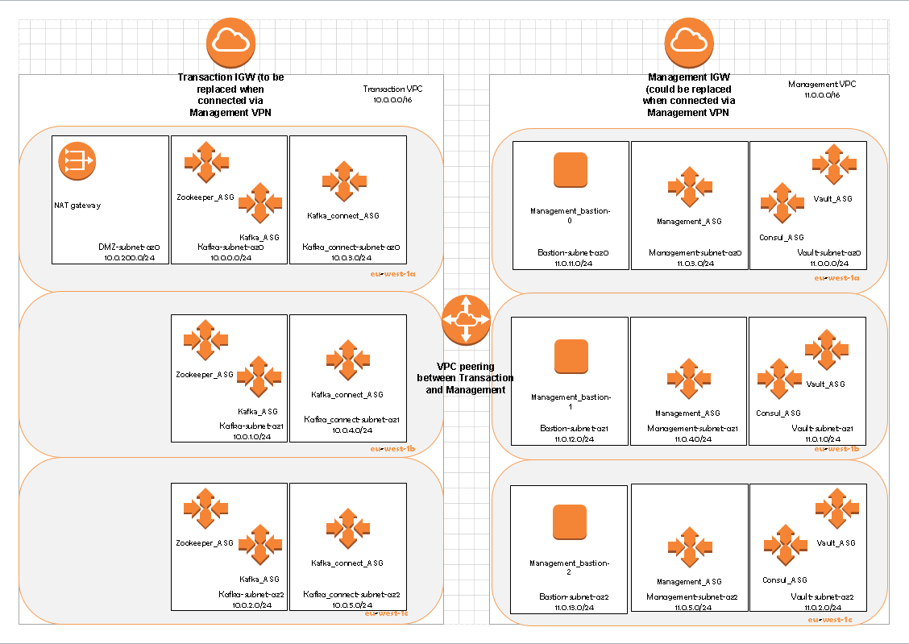

# Kafka Zookeeper with Vault



## Accelerator for running Kafka, Zookeeper, and Vault in AWS 
### About the Accelerator
- Packer files for the Bastion hosts, Management tools, Kafka, Zookeeper, Consul and Vault servers
- Terraform files the Bastion hosts, Management tools, Kafka, Zookeeper, Consul and Vault servers/ASG's
- Python scripts to start the applications on the servers
- The design has two VPC's:

&nbsp;&nbsp; Transaction - where the main app resides that uses Kafka/zookeeper

&nbsp;&nbsp; Management - where the bastions, Management tools, and Vault reside

- within these VPC's are separate subnets to allow the components to be divided across AZ's
via the ASG's. You can vary the size of the ASG's: 

&nbsp;&nbsp; -The zookeeper ASG has 3 intances (it's recommended to start with 3 to give full resiliance and no more than 5) 

&nbsp;&nbsp; -The Kafka ASG has 5

&nbsp;&nbsp; -The Kafka Connect ASG has 3

&nbsp;&nbsp; -The Consul ASG has 3

&nbsp;&nbsp; -The Vault ASG has 3

&nbsp;&nbsp; -The Management ASG has 3

- The Kafka Connect nodes have been set up in distributed mode, but has no connectors defined

- VPC peering allows traffic between the Management and Transaction VPC's

- The ASG intances get allocated valid Name tags (and DNS names) via instance tracking 
DynamoDB tables. DynamoDB tables were used instead of S3 objects because of issues with 
latency and race conditions. Often instances would get the same names on environment 
creation. If you wish to use S3, there is commented code both in the Packer and Terraform files that 
show you how to do this.

- The Management instances have two pre-installed Kafka and Zookeeper management tools 
installed via docker images: 
    - Kafka Manager (port 9000 - https://github.com/yahoo/kafka-manager)
    - Zoonavigator (port 8001 - https://github.com/elkozmon/zoonavigator)
    
- The Consul ASG has an ELB in front of it for ASG health checking and allows the Vault cluster 
instances to utilise the Consul cluster, as the consul client agents just don't work.


### Pre-Reqs
- Terraform installed
- Packer installed
- AWS CLI installed

### Getting Started Instructions
#### Populate your variable JSON file
- The example-file.json looks like:
```
{
  "pem_file_location" : "path to where you have your .pem file",
  "pem_file" : "name of the .pem file",
  "aws_account_id" : "root account id",
  "arn_for_terraform_iam_role" : "arn for the iam role to be used by Terraform",
  "aws_access_key" : "access key for ssh user",
  "aws_secret_key" : "secrey key for ssh user",
  "s3_state_bucket_name" : "name for the terraform start bucket",
  "access_key_pair" : "genned ker pair needed for the instance user of the servers"
}

```
Replace these with your values

#### run the variable update script
- Run replace-placeholders.sh (ensuring that it has execute privleges). if you have just updated the example-file.json:

    `replace-placeholders.sh --file example-file.json`
    
    Ensure that your output looks like:
    
```
./replace-placeholders.sh --file example-file.json
2018-01-12 11:34:27 [INFO] [replace-placeholders.sh] base path is: /The path to your project base where the script is run
2018-01-12 11:34:27 [INFO] [replace-placeholders.sh] Starting placeholder replacement
2018-01-12 11:34:27 [INFO] [replace-placeholders.sh] variable file location: example-file.json
2018-01-12 11:34:27 [INFO] [replace-placeholders.sh] pem_file_location is: the value you entered
2018-01-12 11:34:27 [INFO] [replace-placeholders.sh] pem_file is: the value you entered
2018-01-12 11:34:27 [INFO] [replace-placeholders.sh] aws_account_id is: the value you entered
2018-01-12 11:34:27 [INFO] [replace-placeholders.sh] arn_for_terraform_iam_role is: the value you entered
2018-01-12 11:34:27 [INFO] [replace-placeholders.sh] aws_access_key is: the value you entered
2018-01-12 11:34:27 [INFO] [replace-placeholders.sh] aws_secret_key is: the value you entered
2018-01-12 11:34:27 [INFO] [replace-placeholders.sh] s3_state_bucket_name is: the value you entered
2018-01-12 11:34:27 [INFO] [replace-placeholders.sh] access_key_pair is: the value you entered
2018-01-12 11:34:27 [INFO] [replace-placeholders.sh] Packer .json fle Placeholder replacement complete!
2018-01-12 11:34:27 [INFO] [replace-placeholders.sh] Script Placeholder replacement complete!
2018-01-12 11:34:27 [INFO] [replace-placeholders.sh] Terraform Placeholder replacement complete!
2018-01-12 11:34:28 [INFO] [replace-placeholders.sh] .pem file placement complete!
2018-01-12 11:34:28 [INFO] [replace-placeholders.sh] Placeholder replacement complete!

```

#### Create the AMI's needed with Packer
- In the Packer directories containing the respctive .json files:
    - packer build consul.json
    - packer build vault.json
    - packer build management-tools.json
    - packer build kafka_connect.json
    - packer build kafka.json
    - packer build zookeeper.json
    - packer build bastion_base.json
    
- when all built successfully you shouls see a list like this in your EC2 -> My AMI's
    

### Using the Environment
- In /Terraform/envs/test:
    - init Terraform:  **terraform init -var-file=&lt;directory of your credential file&gt;/credentials.tvars**
    - get the modules: **terraform get**
    - run the plan:  **terraform plan -var-file=&lt;directory of your credential file>&gt;/credentials.tvars -out=./plan**
    - create the environment: **terraform apply ./plan**
- when fully run, your AWS instances will look like:


### to-Do's
- Vault requires harcoded AWS keys in run-vault, this needs fixing
- Consul requires harcoded AWS keys in run-consul, this needs fixing

### License
Copyright [2017] [Paul Pogonoski]

Licensed under the Apache License, Version 2.0 (the "License");
you may not use this file except in compliance with the License.
You may obtain a copy of the License at

    http://www.apache.org/licenses/LICENSE-2.0

Unless required by applicable law or agreed to in writing, software
distributed under the License is distributed on an "AS IS" BASIS,
WITHOUT WARRANTIES OR CONDITIONS OF ANY KIND, either express or implied.
See the License for the specific language governing permissions and
limitations under the License.
